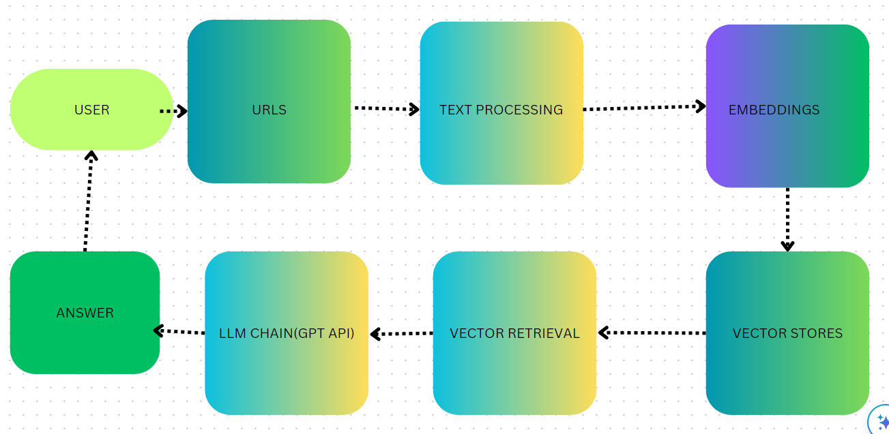

<!-- PROJECT LOGO -->
<br />
<div align="center">

  <a href="https://github.com/othneildrew/Best-README-Template">
    
  </a>

  <h3 align="center">News Article research tool</h3>

  <p align="center">
    An awesome companion to help with your research!
    <br />
    <br />
    <br />
    <a href="https://github.com/othneildrew/Best-README-Template">View Demo</a>

  <h3 align="center">News Article Research Tool</h3>

  <p align="center">
    An awesome tool to help your research journey
    <br />

 </p>
</div>


<!-- TABLE OF CONTENTS -->
<details>
  <summary>Table of Contents</summary>
  <ol>
    <li>
      <a href="#about-the-project">About The Project</a>
      <ul>
        <li><a href="#built-with">Built With</a></li>
      </ul>
    </li>
    <li>
      <a href="#getting-started">Getting Started</a>
      <ul>
        <li><a href="#prerequisites">Prerequisites</a></li>
        <li><a href="#installation">Installation</a></li>
      </ul>
    </li>
    <li><a href="#usage">Usage</a></li>
    <li><a href="#roadmap">Roadmap</a></li>
    <li><a href="#contributing">Contributing</a></li>
    <li><a href="#license">License</a></li>
    <li><a href="#contact">Contact</a></li>
    <li><a href="#acknowledgments">Acknowledgments</a></li>
  </ol>
</details>


<!-- ABOUT THE PROJECT -->
## About The Project
Introducing the News Article Research Tool: Empower yourself to effortlessly extract profound insights from the extensive realm of online news. Our cutting-edge solution lets users seamlessly upload article URLs and receive pinpoint answers to their queries. By harnessing the latest in web scraping, natural language processing, and search technologies, we've created a user-friendly and comprehensive tool that's your gateway to informed decision-making, research support, and an enriched interaction with the dynamic world of news.* Your time should be focused on creating something amazing. A project that solves a problem and helps others

## Methodology



### Built With
* PYTHON
* BEAUTIFUL SOUP
* OPENAI
* LANGCHAIN

<p align="right">(<a href="#readme-top">back to top</a>)</p>


<!-- GETTING STARTED -->
## Getting Started

To get started, sign up for an OpenAI account and generate an API key. This key will allow you to access and utilize the OpenAI API effectively. Finally, clone the repository to your local machine using the `git clone` command with the repository URL.
```sh
git clone https://github.com/OwusuBlessing/Langchain-Project.git
```

### Prerequisites
To set up a virtual environment, you can choose to use either Python's built-in virtual environment tools or Anaconda, depending on your preference. Open your terminal and navigate to the cloned repository directory. From there, create your virtual environment using your preferred method
* Using Python's venv Module write the following command one after the other:
  ```sh
  python -m venv myenv
  
  myenv\Scripts\activate
  
  source myenv/bin/activate

  ```
  

* Using Anaconda write the following command one after the other:
  ```sh
  conda create --name myenv
  
  conda activate myenv
  ```


### Installation


1. Get your API Key at [https://platform.openai.com/](https://platform.openai.com/)
2. Clone the repo
   ```sh
   git clone https://github.com/OwusuBlessing/Langchain-Project.git
   ```
3. Install packages after activating your virtual environment and run:
   ```sh
   pip install -r requirements.txt
   ```
4. Enter your API in `.env`
   ```env
   OPENAI_API_KEY="ENTER YOUR API"
   ```

<p align="right">(<a href="#readme-top">back to top</a>)</p>


<!-- USAGE EXAMPLES -->
## Usage
This project serves a versatile range of purposes, making it valuable for research, personal studies, and content generation driven by the URLs you provide. The potential for generating valuable content is substantial, determined by the precision and creativity of your input.


<!-- CONTRIBUTING -->
## Contributing

Contributions are what make the open source community such an amazing place to learn, inspire, and create. Any contributions you make are **greatly appreciated**.

If you have a suggestion that would make this better, please fork the repo and create a pull request. You can also simply open an issue with the tag "enhancement".
Don't forget to give the project a star! Thanks again!

1. Fork the Project
2. Create your Feature Branch (`git checkout -b feature/AmazingFeature`)
3. Commit your Changes (`git commit -m 'Add some AmazingFeature'`)
4. Push to the Branch (`git push origin feature/AmazingFeature`)
5. Open a Pull Request

<p align="right">(<a href="#readme-top">back to top</a>)</p>


<!-- CONTACT -->
## Contact
Name - Owusu Samule Blessing
Email - owususammy509@gmail.com

<p align="right">(<a href="#readme-top">back to top</a>)</p>


<!-- ACKNOWLEDGMENTS -->
## Acknowledgments

Here is a list of resources that proven to be really helpful in implementing this project

* [Beautiful soup Guide](https://realpython.com/beautiful-soup-web-scraper-python/)
* [A comprehenwsive langchain documentatio n](https://python.langchain.com/docs/get_started/introduction)
* [Langchain crash course](https://www.youtube.com/watch?v=nAmC7SoVLd8&t=2445s)
* [News article project on youtube](https://www.youtube.com/watch?v=MoqgmWV1fm8)
<p align="right">(<a href="#readme-top">back to top</a>)</p>

